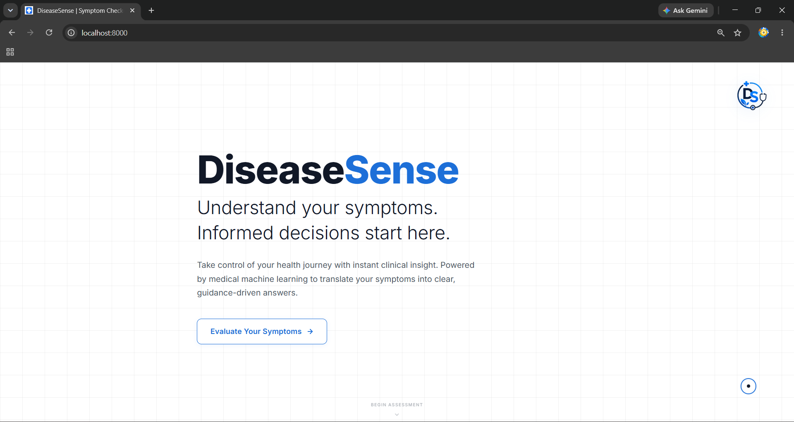
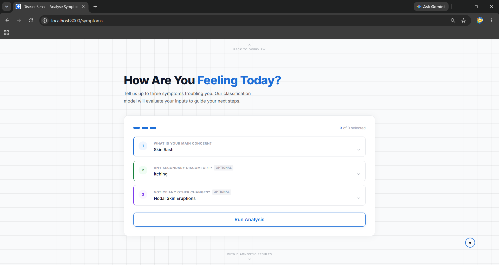
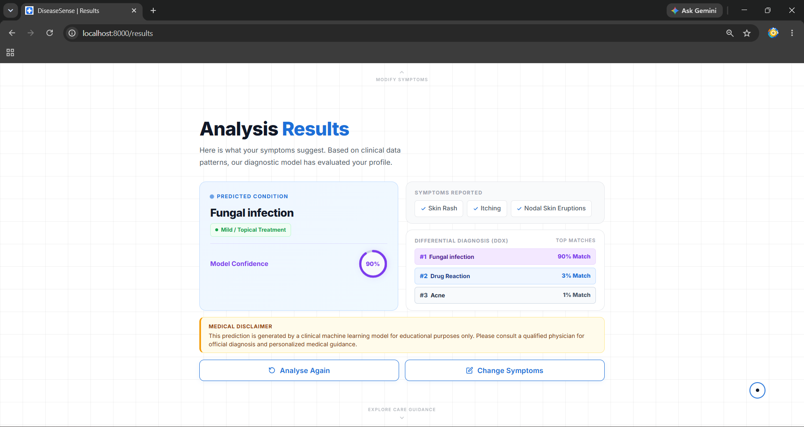
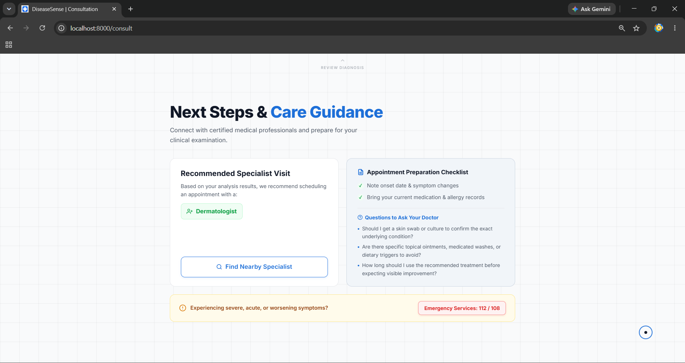

# 🧬 DiseaseSense : Machine Learning Symptom Analysis

**DiseaseSense** is a machine learning web application built with **Python**, **Django**, and **Scikit-Learn** that predicts potential disease classes based on user-selected symptoms. It combines machine learning predictions with basic clinical guidance to help users better understand their symptoms before consulting a healthcare professional.

---

## ✨ Highlights

- 🩺 Disease prediction from selected symptoms
- 🎯 Top 3 predicted conditions
- 📊 Prediction probability
- 🚨 Urgency assessment
- 👨‍⚕️ Specialist recommendation
- 📍 Nearby specialist search
- 📋 Appointment preparation guidance
- 💬 Suggested questions for doctors

---

## 📸 Project Snapshots

The screenshots below showcase the complete **DiseaseSense** workflow, from symptom selection to AI-powered disease prediction and care guidance.

### 🏠 1. Home / Landing Page

The landing page introduces **DiseaseSense** and allows users to begin a symptom assessment.

<p align="center">
  
</p>

---

### 🩺 2. Symptom Analysis

Users can select up to **three symptoms** using interactive, searchable dropdowns before running the disease prediction.

<p align="center">
  
</p>

---

### 📊 3. Analysis Results

The prediction results display the **most likely disease**, **confidence score**, **selected symptoms**, and the **Top 3 predicted conditions** generated by the machine learning model.

<p align="center">
  
</p>

---

### 👨‍⚕️ 4. Care Guidance & Specialist Recommendation

Based on the prediction, DiseaseSense provides **specialist recommendations**, **appointment preparation guidance**, **consultation questions**, and **emergency care advice** to help users understand their next steps.

<p align="center">
  
</p>

---

## 🛠️ Tech Stack

| Category | Technologies |
| --- | --- |
| **Language** | Python |
| **Backend** | Django |
| **Machine Learning** | Scikit-Learn, Pandas, NumPy |
| **Frontend** | HTML5, CSS3, JavaScript |
| **Visualization** | Matplotlib, Seaborn |
| **Model Serialization** | Joblib |
| **Development Tools** | Jupyter Notebook, VS Code, Git |
| **Dataset** | Training.csv — 132 Symptoms, 41 Disease Classes |

---

## ✨ Core Features

DiseaseSense combines machine learning predictions with simple clinical guidance to help users better understand their symptoms.

| Feature | Description |
| --- | --- |
| **Disease Prediction** | Predicts potential disease classes from selected symptoms using a trained ML model. |
| **Top 3 Predictions** | Displays the three highest-probability predictions. |
| **Prediction Probability** | Shows the model's estimated probability for the primary prediction. |
| **Urgency Assessment** | Categorizes predicted conditions into High, Moderate, or Low urgency. |
| **Specialist Recommendation** | Suggests a relevant medical specialist based on the prediction. |
| **Nearby Specialist Search** | Uses Google Maps to help locate nearby specialists. |
| **Appointment Guidance** | Provides preparation tips and suggested questions for a doctor consultation. |

---

## 🏗️ Workflow & Prediction Pipeline

The following workflow shows how user input moves through the prediction pipeline before the final results are displayed.

```text
👤 User Selects Symptoms
        ↓
🧹 Symptom Validation & Processing
        ↓
⚙️ Feature Vectorization
        ↓
🧠 Logistic Regression Model
        ↓
📊 Probability Estimation
        ↓
🎯 Top 3 Predictions
        ↓
🩺 Clinical Guidance
        ↓
🌐 Final Results
```

---

## 🧪 Machine Learning

DiseaseSense uses supervised multi-class classification to predict disease classes from symptom-based feature vectors.

The model was trained on **132 symptoms** across **41 disease classes**. After comparing multiple machine learning algorithms, **Logistic Regression** was selected for deployment due to its speed, interpretability, low computational overhead, and support for `predict_proba()`.

### 📊 Model Performance Comparison

| Model                         |    Accuracy |
| ----------------------------- | ----------: |
| **Logistic Regression**       | **100.00%** |
| **K-Nearest Neighbors (KNN)** | **100.00%** |
| **Naïve Bayes**               | **100.00%** |
| Decision Tree                 |      97.62% |
| Random Forest                 |      97.62% |
| Gradient Boosting             |      97.62% |

**Logistic Regression** was selected for deployment due to its fast inference, interpretability, low computational overhead, and support for `predict_proba()`.

The trained model is serialized using **Joblib** and integrated with the Django backend.

> **Note:** The reported accuracy is based on the project's dataset and evaluation methodology and does not represent real-world clinical diagnostic accuracy.

---

## 🚀 Getting Started

Follow the steps below to set up and run DiseaseSense locally.

### 1️⃣ Clone the Repository

```bash
git clone https://github.com/Sai-10z/DiseaseSense.git
cd DiseaseSense
```

### 2️⃣ Create a Virtual Environment

Windows
```bash
python -m venv venv
venv\Scripts\activate
```

Linux / macOS
```bash
python3 -m venv venv
source venv/bin/activate
```

### 3️⃣ Install Dependencies

```bash
pip install -r requirements.txt
```

## 4️⃣ Navigate to the Django Application

```bash
cd app
```

### 5️⃣ Start the Development Server

```bash
python manage.py runserver
```

### 6️⃣ Open the Application

```bash
Open your browser and visit: http://127.0.0.1:8000/
```

---

## 📂 Repository Structure

```text
DiseaseSense/
│
├── Disease_Prediction_Model_Training.ipynb
├── Snapshots/
│   ├── home.jpg
│   ├── symptoms.jpg
│   ├── results.jpg
│   └── consult.jpg
│
├── app/
│   ├── manage.py
│   ├── Training.csv
│   ├── model.joblib
│   ├── retrain_model.py
│   │
│   ├── backend/
│   │   ├── settings.py
│   │   ├── urls.py
│   │   ├── views.py
│   │   ├── wsgi.py
│   │   └── asgi.py
│   │
│   ├── templates/
│   │   └── index.html
│   │
│   └── static/
│       ├── Logo.jpg
│       └── Favicon.jpg
│
├── requirements.txt
└── README.md
```

---

## 🔮 Future Improvements

- Explainable AI (XAI) to show how symptoms influence predictions
- Symptom tracking to monitor changes over time
- AI-powered health assistant for follow-up queries
- Downloadable clinical summary reports
- Multi-language support
- Enhanced prediction models using ensemble learning
- Integration with healthcare APIs for improved specialist information

---

## ⚙️ Limitations

- Trained on a single symptom dataset and not clinically validated.
- Currently limited to a maximum of three selected symptoms.
- Does not consider patient history, medications, laboratory results, or other clinical factors.
- Urgency and specialist recommendations are based on predefined application logic.
- Nearby specialist search depends on external map services.

---

## ⚠️ Disclaimer

DiseaseSense is an **academic machine learning project** developed for learning and demonstration purposes. Its predictions and guidance are estimates and **not a substitute for professional medical diagnosis, treatment, or advice**. Always consult a qualified healthcare professional for medical concerns.

---

## 👨‍💻 Internship Project

DiseaseSense was developed during my internship as a **Machine Learning and Full-Stack Development project**.

### Responsibilities

- Performed data preprocessing, EDA, and model comparison.
- Selected and deployed **Logistic Regression** for disease prediction.
- Built the Django backend and integrated the trained ML model.
- Developed the symptom analysis and prediction interface.
- Implemented Top 3 predictions using `predict_proba()`.
- Added specialist recommendations, consultation guidance, and Google Maps integration.

---
