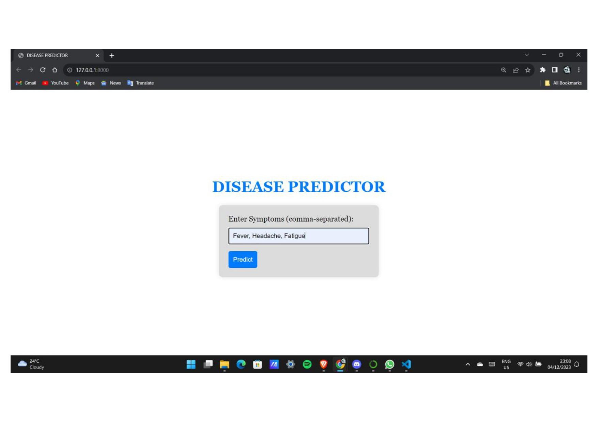
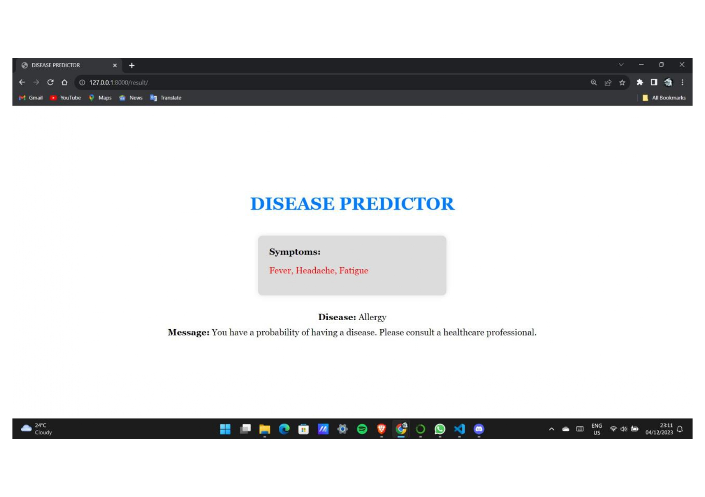

# 🧬 Disease Prediction System using Machine Learning

A Django-based machine learning web application that predicts potential diseases from user-entered symptoms.  
The project was developed to explore how machine learning can assist in healthcare-oriented prediction systems by combining data preprocessing, exploratory data analysis (EDA), multi-model evaluation, and real-time prediction through an interactive web interface.

Multiple classification algorithms were trained and compared using symptom-based datasets, with Logistic Regression selected as the final model for its simplicity, interpretability, and reliable performance.

---

# 🚀 Tech Stack

[](https://www.python.org/)
[](https://www.djangoproject.com/)
[](https://scikit-learn.org/)
[](https://pandas.pydata.org/)
[](https://numpy.org/)
[](https://jupyter.org/)
[](https://developer.mozilla.org/en-US/docs/Web/HTML)
[](https://developer.mozilla.org/en-US/docs/Web/CSS)
[](https://git-scm.com/)
[](https://github.com/)

---

# 🏗 Workflow & Prediction Pipeline

```bash
👤 User Inputs Symptoms
          ↓
🌐 Django Web Interface
          ↓
⚡ Django Backend Processing
          ↓
🧠 Trained Machine Learning Model (.pkl)
          ↓
📊 Disease Prediction Logic
          ↓
✅ Predicted Disease Returned To User
```

---

# ✨ Core Features

## 🧠 Machine Learning Module
- Data preprocessing and cleaning  
- Exploratory Data Analysis (EDA)  
- Correlation heatmap generation  
- Multi-model training and evaluation  
- Model performance comparison  
- Trained model serialization using Pickle  

## 🌐 Web Application Module
- Django-based interactive interface  
- Symptom-based disease prediction  
- Real-time prediction output  
- Backend integration with trained ML model  
- Simple and user-friendly workflow  

## 📊 Data Analysis & Visualization
- Prognosis distribution graphs  
- Symptom correlation heatmaps  
- Model accuracy comparison charts  
- Dataset exploration and preprocessing analysis  

---

# 🧪 Machine Learning Models & Results

| Model | Accuracy (%) |
|--------|--------------|
| Logistic Regression | 100 |
| K-Nearest Neighbors (KNN) | 100 |
| Naïve Bayes | 100 |
| Decision Tree | 97.619 |
| Random Forest | 97.619 |
| Gradient Boosting | 97.619 |

### ✅ Final Model Selection

Although multiple models achieved perfect accuracy, **Logistic Regression** was selected as the final model due to:

- Simplicity and efficiency  
- Better interpretability  
- Lower risk of overfitting  
- Suitable behavior for healthcare-oriented prediction systems  

---

# ⚙️ Development Workflow

## 📌 Phase 1 – Model Development

- Dataset preprocessing and cleaning  
- Feature analysis and visualization  
- Exploratory data analysis (EDA)  
- Training multiple ML algorithms  
- Performance evaluation and comparison  
- Final model selection  

## 📌 Phase 2 – Web Application Integration

- Model serialization using Pickle (`.pkl`)  
- Django backend integration  
- Symptom input form development  
- Real-time prediction handling  
- Result rendering on frontend  

---

# 📂 Repository Structure

```text
Disease-Prediction-System/
│
├── dataset/
│   ├── Training.csv
│   └── Testing.csv
│
├── Snapshots/
├── notebooks/
├── templates/
├── static/
├── model/
├── README.md
└── requirements.txt
```

---

# 📸 Project Snapshots

| Screenshot | Description |
|------------|-------------|
|  | Symptom input interface |
|  | Predicted disease output |

---

# 🧠 Skills Demonstrated

- Machine Learning model development  
- Data preprocessing & cleaning  
- Exploratory Data Analysis (EDA)  
- Classification algorithms implementation  
- Model evaluation & comparison  
- Django web application integration  
- Backend prediction systems  
- Data visualization techniques  
- Real-time ML inference workflow  

---

# 🔐 Project Note & Disclaimer

> Source code is not included in this repository as the project was developed as part of an internship program. This repository is intended to showcase the machine learning workflow, dataset usage, model evaluation, visualizations, and Django web integration. The project is designed for educational and research purposes only and should not be considered as professional medical advice, diagnosis, or treatment.

---
